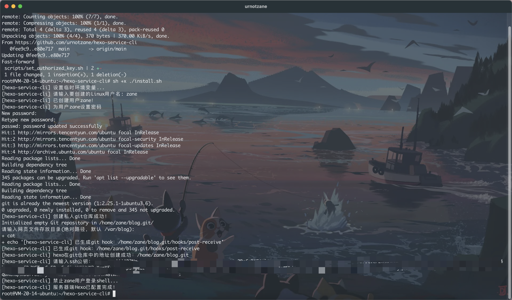

# Hexo-service-cli
自动部署hexo博客站点

效果预览：[ithen.cn](https://ithen.cn)

## Hexo在私有服务器自动部署指南
### 前置工作
本地电脑生成ssh密钥
```bash
# -C 设置注释文字，比如你的邮箱
ssh-keygen -t rsa -C  'xxx@xxx.com'

# 查看公钥
cat ~/.ssh/id_rsa.pub
```
### 服务器配置
使用ssh登录服务器，然后执行以下命令：
```bash
su
git clone https://github.com/urnotzane/hexo-service-cli.git

cd hexo-service-cli
# 执行安装程序
sh +x ./install.sh
```
根据脚本步骤进行配置，在ssh公钥步骤中输入前置工作生成的公钥内容：


当输出`服务器端Hexo已配置完成！`时配置服务器成功。

### 配置Nginx
1. 安装

```bash
sudo apt install nginx
```
若输入nginx -V可以看到nginx版本信息，则安装成功。

2. 配置nginx

```bash
vim /etc/nginx/conf.d/blog.conf
```
输入：
```config
# blog.conf
server {
  # 默认端口
  listen 80 default_server;
  # 若是https，还要加下面一行
  # listen 443 ssl http2;
  # 站点根目录
  root /var/blog;
  # 首页
  index index.htm index.html index.php;
  # 域名
  server_name ithen.cn  www.ithen.cn;
  # nginx用来路由的入口
  location / {
    try_files $uri $uri/ /index.html;
  }
}
```
3. 设置开机启动nginx

```bash
chkconfig nginx on
# 启动nginx
service nginx start
```
其他关于nginx的命令

```bash
# 查看服务器状态
service nginx status
# 关闭服务器
service nginx stop
# 重启服务器
service nginx restart
```

### 创建Hexo项目
1. 安装

```npm install hexo-cli -g```
2. 初始化

```bash
hexo init hexo-project
cd hexo-project
# 安装依赖
npm install
# 本地查看网站
hexo server
```
3. 配置Hexo
打开Hexo项目根目录下的_config.yml文件，找到最后的deploy配置，修改为：
```yaml
deploy:
- type: git
  repo: git@V服务器的IP:/home/${`服务器配置步骤`用户名}/blog.git
  branch: master
# 还可以同时部署到github
-type: git
  repo: git@github.com:xxxx/xxxx.github.io.git
  branch: master  
```
现在，使用命令hexo d就可以将网站部署到配置好的服务器上了。

## 常用Hexo命令
```bash
# 新建文章
hexo new <title>
# 清除缓存文件db.json和已生成的静态文件public
hexo clean
# 生成静态文件
hexo generate
# 本地运行服务器
hexo server
# 部署网站
hexo deploy
```

## 完结